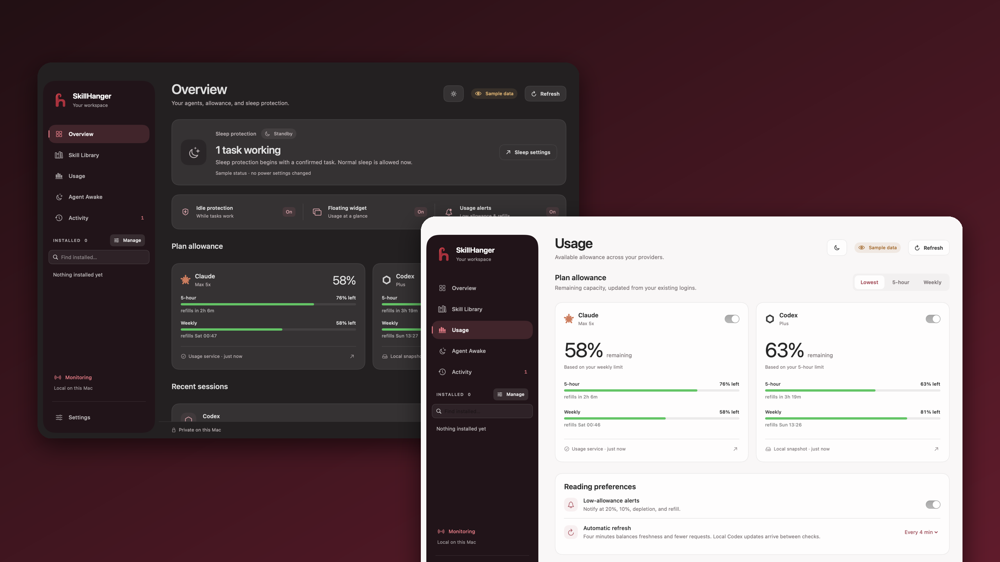
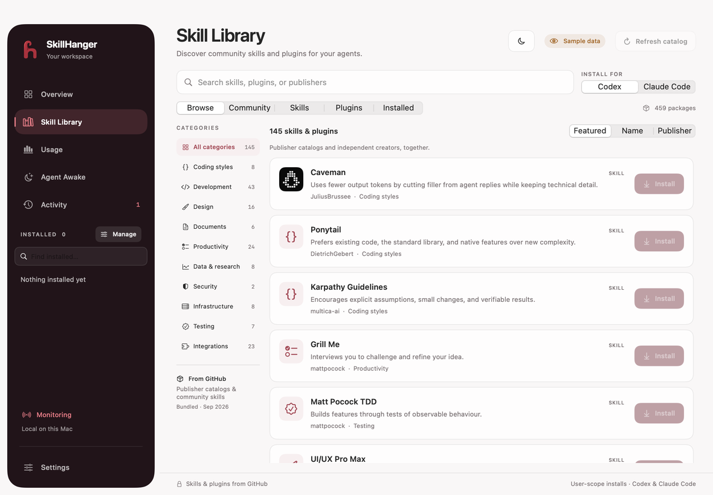
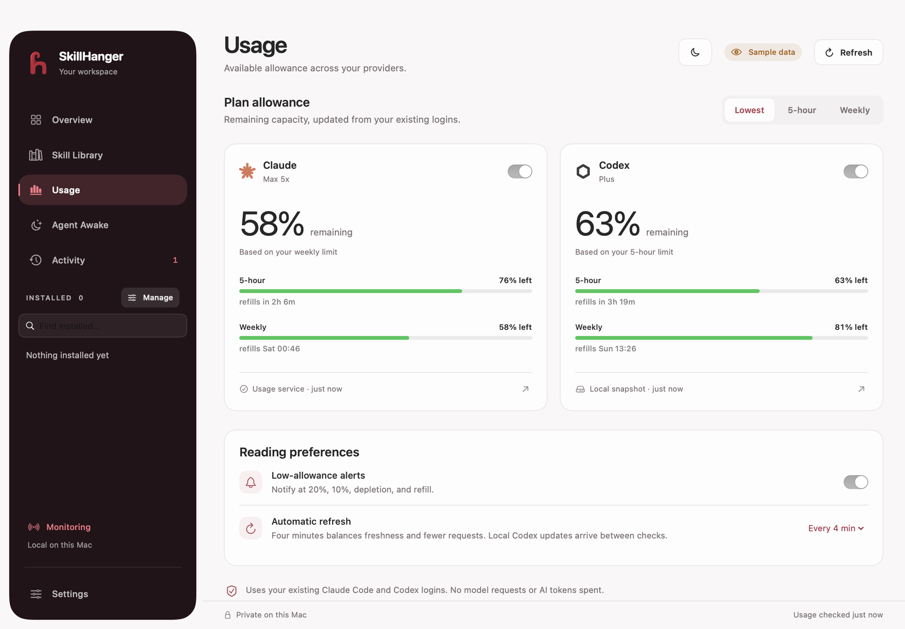
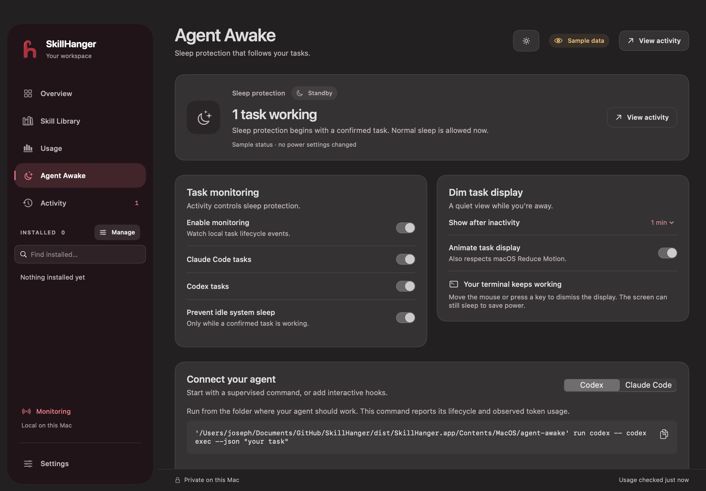
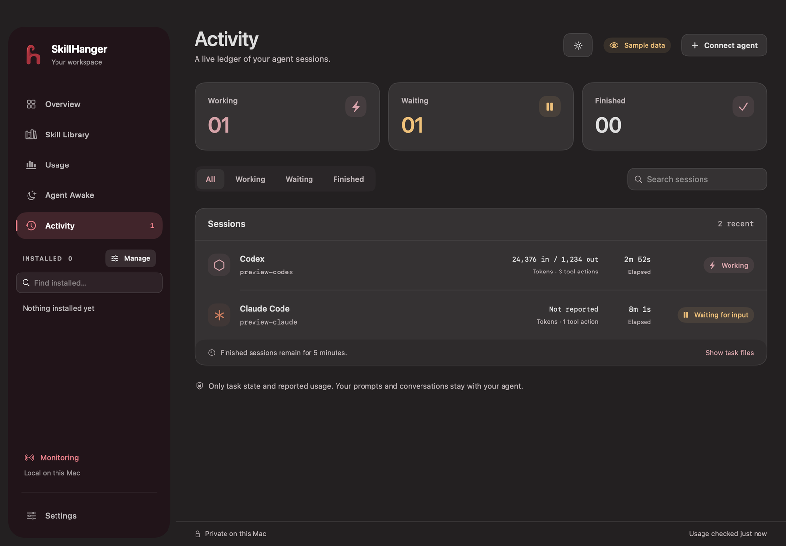
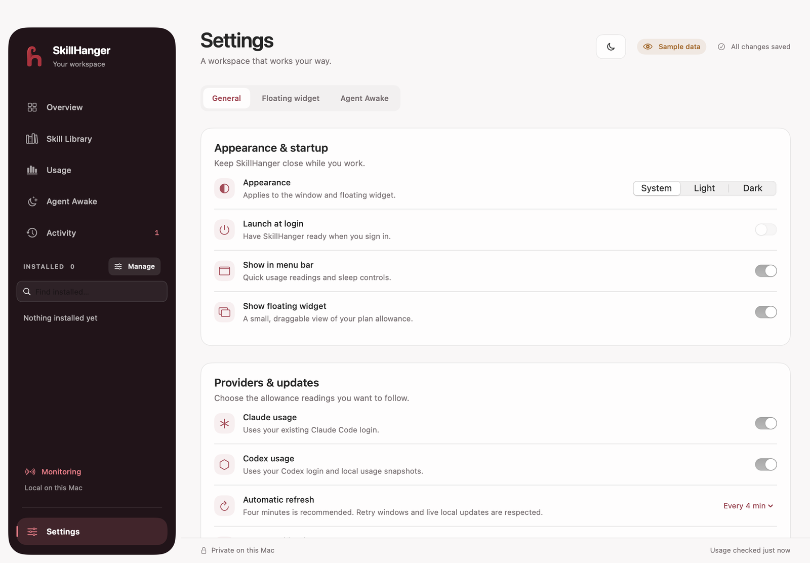
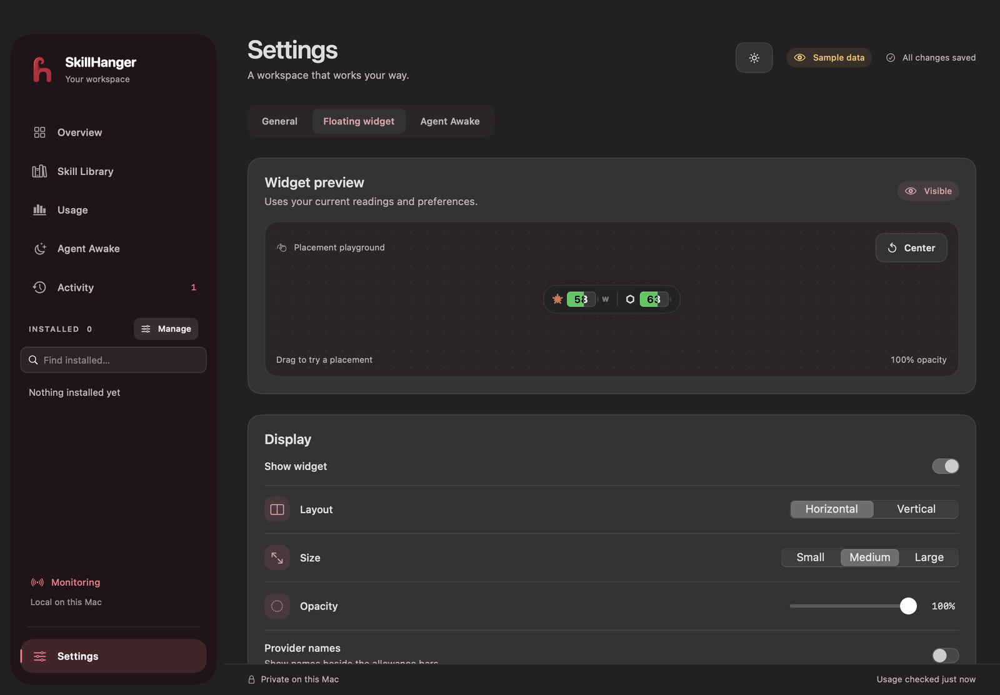
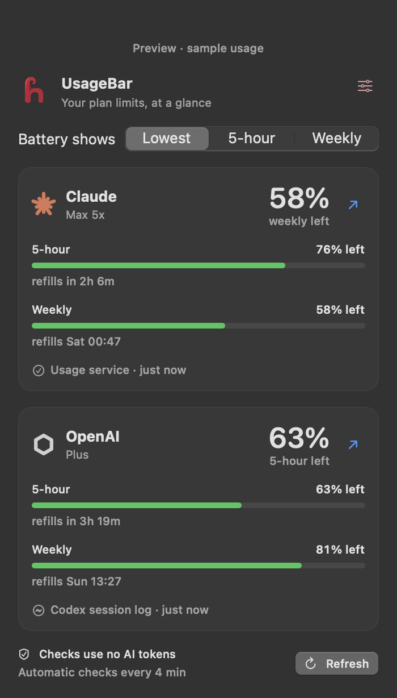

<p align="center">
  
</p>

<h1 align="center">SkillHanger</h1>
<p align="center"><strong>Find better tools for your AI. See your limits. Keep work running.</strong></p>
<p align="center">A free, open-source native Mac app for people who work with Claude Code and Codex.</p>

<p align="center">
  <a href="https://github.com/icarus2419/SkillHanger/releases/latest"></a>
  <a href="LICENSE"></a>
  
  
</p>

<p align="center"><a href="#install">Install</a> · <a href="#what-you-can-do">Features</a> · <a href="#screenshots">Screenshots</a> · <a href="#your-first-five-minutes">First steps</a> · <a href="#privacy-and-permissions">Privacy</a> · <a href="#contributing">Contribute</a></p>

<p align="center">
  
</p>

<picture>
  <source media="(prefers-color-scheme: dark)" srcset="docs/images/skill-library-dark.png">
  <source media="(prefers-color-scheme: light)" srcset="docs/images/skill-library-light.png">
  
</picture>

*Screenshots and the tour below use the app's isolated preview mode. Usage values and task activity are sample data.*

Coding with an AI assistant means more than writing prompts. You need useful tools, enough allowance to finish, and a Mac that stays awake while a long task runs. SkillHanger brings those pieces together in one window, with small battery indicators you can keep on your desktop and in the menu bar.

**UsageBar** is the name of the usage display. **Agent Awake** is the task-monitoring and sleep-control page. Both are built into SkillHanger.

## What you can do

| Feature | What it does for you |
| --- | --- |
| **Discover skills and plugins** | Search a library of GitHub packages for coding, design, testing, documents, and more. See what each package does and install it for Codex or Claude Code. |
| **Manage what you've installed** | Find installed packages in the sidebar, open their settings, copy an invocation, and disable or remove supported packages. |
| **See your remaining AI allowance** | Check session and weekly limits, reset times, and how fresh each reading is. Two small batteries keep the remaining percentage visible without opening the dashboard. |
| **Keep your Mac awake during work** | Prevent idle sleep while a monitored task is running. Waiting or finished tasks let normal sleep resume. |
| **Follow your agent's progress** | See working, waiting, finished, and interrupted sessions, elapsed time, observed tool actions, and token counts when the agent supplies them. |
| **Make it fit your desktop** | Choose light or dark appearance and customize the floating widget's size, layout, colors, opacity, position, and locking. |

A **skill** is a folder of instructions and supporting files that teaches an AI assistant a workflow. A **plugin** is a package that can add capabilities or connections to other services. SkillHanger helps you discover and manage them; your chosen assistant runs them.

### A quick look around


The floating batteries and menu-bar batteries open a compact usage popup when clicked. Closing the main window leaves monitoring running; choose **Quit SkillHanger** to stop the app.

Use **⌘1–⌘6** to open the library, overview, usage, Agent Awake, activity, and installed packages. **⌘F** focuses library search, **Esc** clears it, **⌘R** refreshes usage or the catalog, and **⌘,** opens Settings. Catalog refresh shows its progress and can be canceled while you continue browsing saved packages.

## Screenshots

<table>
  <tr>
    <td width="50%"><br><sub><b>Usage</b> · session and weekly limits, reset times, freshness</sub></td>
    <td width="50%"><br><sub><b>Agent Awake</b> · sleep protection while tasks run</sub></td>
  </tr>
  <tr>
    <td width="50%"><br><sub><b>Activity</b> · working, waiting, finished, interrupted</sub></td>
    <td width="50%"><br><sub><b>Settings</b> · appearance, alerts, refresh cadence</sub></td>
  </tr>
  <tr>
    <td width="50%"><br><sub><b>Floating widget</b> · size, layout, colors, opacity, position</sub></td>
    <td width="50%" align="center"><br><sub><b>Menu bar popup</b> · one click from the battery</sub></td>
  </tr>
</table>

## Install

**Download:** grab the latest `SkillHanger-x.y.z.zip` from [Releases](https://github.com/icarus2419/SkillHanger/releases/latest), unzip, and drag SkillHanger to Applications. The app is not yet notarized by Apple, so the first time, **right-click the app → Open → Open**.

## Build from source

**Requirements:** macOS 13 or later and a Swift 6 toolchain to build the app. Sign in to Codex with a ChatGPT account or to Claude Code to see your plan limits. An API-key-only Codex login does not provide ChatGPT plan allowance.

From the project folder, run:

```sh
make app
open dist/SkillHanger.app
```

The build creates `dist/SkillHanger.app`. You can move it to Applications, or use `Start SkillHanger.command` in the project folder. That launcher builds the app if a package is missing.

SkillHanger reads the login already stored by the assistant on your Mac. You do not paste an API key into SkillHanger.

## Your first five minutes

1. **Find a useful package.** Open **Skill Library**, choose Codex or Claude Code, then search or pick a category. Open a package to review its description, publisher, and GitHub source before installing.
2. **Make it yours.** After installation, open its sidebar page to see instructions and supported options. Copy its invocation into your assistant. Start a new assistant session after installing; some plugins also need account setup in the assistant.
3. **Check your allowance.** Open **Usage** to see session and weekly limits. In **Settings**, choose whether each battery shows the session limit, weekly limit, or whichever has less remaining.
4. **Keep the numbers nearby.** Enable the floating widget and menu-bar display. Drag the widget to a convenient spot; right-click it for settings. Readings update automatically. Provider requests normally run every four minutes, with local Codex log updates arriving between requests. Network errors and rate limits can delay a fresh reading.
5. **Connect task monitoring when you need it.** Open **Agent Awake** for command and hook setup. Monitoring needs task events from the assistant or the supervised command below; simply opening an assistant does not prove it is working.

### Keep a long task awake

Run a finite task through SkillHanger's command-line helper from the directory where you want the assistant to work:

```sh
/path/to/SkillHanger.app/Contents/MacOS/agent-awake run codex -- codex exec --json "your task"
```

For Claude Code:

```sh
/path/to/SkillHanger.app/Contents/MacOS/agent-awake run claude -- claude -p --output-format json "your task"
```

Replace `/path/to/SkillHanger.app` with the location of your app. Enable **Prevent idle sleep during tasks** in **Agent Awake**. The helper passes input and output through to your terminal and tracks completion, failure, and cancellation. Interactive sessions use provider hooks instead.

**Closing a laptop lid is different from idle sleep.** The optional privileged helper requires explicit installation and opt-in. Its behavior depends on the Mac and needs physical verification before unattended use. Read the [closed-lid setup guide](Resources/ClosedLidSetup.md) before enabling it.

## Privacy and permissions

- Usage checks read existing local login credentials and request allowance metadata from the provider. They do not run model inference or spend tokens.
- Local Codex logs can supply more recent allowance snapshots without another network request.
- Saved usage and task records contain metadata, not prompts, transcripts, or response text.
- Browsing and installing packages contacts GitHub. Skills download at their catalog revision; plugins use the assistant's native command-line tool. Catalog inclusion does not mean every third-party package has been audited.
- Existing name conflicts and edited managed skill files are protected. Removal of an externally installed standalone skill moves its validated folder to Trash.
- Provider hooks, service connections, and the closed-lid helper are not approved automatically.

Usage endpoints are undocumented and may change. SkillHanger shows login errors, old readings, and retry delays rather than treating unavailable data as a current allowance.

Four minutes is the default provider-check interval. Opening a battery popup, waking the Mac, or restarting the app respects the same schedule and saved rate-limit delays. Explicit refreshes have a one-minute cooldown. Older one- and two-minute settings migrate to four minutes once; later choices in Settings are preserved.

<details>
<summary><strong>Set up monitoring for interactive sessions</strong></summary>

Merge handlers into your existing provider configuration. Preserve existing hooks and substitute the absolute path to your app's `Contents/MacOS/agent-awake` binary.

For Claude Code, add entries to the `hooks` object in `~/.claude/settings.json`:

```json
{
  "hooks": {
    "UserPromptSubmit": [{"hooks": [{"type": "command", "command": "/ABSOLUTE/PATH/TO/agent-awake hook claude"}]}],
    "PreToolUse": [{"hooks": [{"type": "command", "command": "/ABSOLUTE/PATH/TO/agent-awake hook claude"}]}],
    "PostToolUse": [{"hooks": [{"type": "command", "command": "/ABSOLUTE/PATH/TO/agent-awake hook claude"}]}],
    "PermissionRequest": [{"hooks": [{"type": "command", "command": "/ABSOLUTE/PATH/TO/agent-awake hook claude"}]}],
    "Notification": [{"matcher": "permission_prompt|idle_prompt", "hooks": [{"type": "command", "command": "/ABSOLUTE/PATH/TO/agent-awake hook claude"}]}],
    "Stop": [{"hooks": [{"type": "command", "command": "/ABSOLUTE/PATH/TO/agent-awake hook claude"}]}],
    "StopFailure": [{"hooks": [{"type": "command", "command": "/ABSOLUTE/PATH/TO/agent-awake hook claude"}]}],
    "SessionEnd": [{"hooks": [{"type": "command", "command": "/ABSOLUTE/PATH/TO/agent-awake hook claude"}]}]
  }
}
```

For Codex, use the same handler shape in `~/.codex/hooks.json`, with `hook codex` for `UserPromptSubmit`, `PreToolUse`, `PostToolUse`, `PermissionRequest`, `Stop`, `Interrupt`, and `SessionEnd`. Inspect `/hooks` in Codex to verify what loaded and review any trust prompt.

Task records live in `~/Library/Application Support/AgentAwake/tasks`, using private directory and file permissions. Hook-only tasks become **status unknown** after 120 seconds without another event, releasing idle-sleep protection. Use the supervised helper for long tasks that may remain silent.

</details>

<details>
<summary><strong>Build, test, and maintain the catalog</strong></summary>

```sh
swift test
make app
```

The app uses SwiftUI and AppKit with no third-party runtime dependencies. Legacy module names, command names, and the generated `dist/AgentAwake.app` alias remain for compatibility.

Refresh bundled package metadata and publisher logos:

```sh
python3 scripts/refresh-marketplace-catalog.py
python3 scripts/refresh-package-logos.py
```

Render an isolated preview without live usage, user task records, or power assertions:

```sh
dist/SkillHanger.app/Contents/MacOS/SkillHanger --render-preview /tmp/skillhanger.png --page usage --appearance light
```

Available pages include `overview`, `marketplace`, `installed`, `usage`, `awake`, `activity`, `package`, and `settings`. Preview data is labeled in the rendered app. Run `python3 scripts/render-ui-previews.py` to check light, dark, compact, and error-state layouts.

`Sources/` contains the app, core libraries, helpers, and bundled assets. `Tests/` contains regression tests and fixtures. `Resources/` contains app metadata and helper setup; `scripts/` contains packaging and catalog tools. Catalog and logo provenance remain in `tasks/evidence/`. `docs/images/` contains the small set of README visuals.

Build caches, packaged apps, generated evidence, local credentials, editor settings, and development instructions are excluded from Git.

</details>

## Contributing

Issues and pull requests are welcome. See [CONTRIBUTING.md](CONTRIBUTING.md) for setup and ground rules, and [SECURITY.md](SECURITY.md) to report a vulnerability privately.

## Support the project

SkillHanger is free and always will be. If it saves you time, star the repo, share it with a friend, or open an issue with what you'd like to see next.

## License

[MIT](LICENSE) © 2026 Joseph. SkillHanger is an independent project and is not affiliated with Anthropic or OpenAI. Claude and Codex are trademarks of their respective owners.
